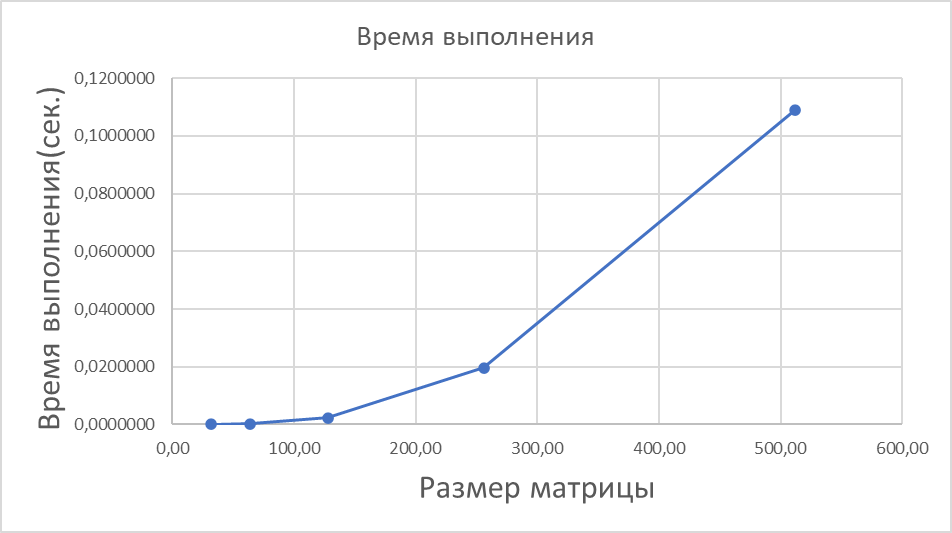
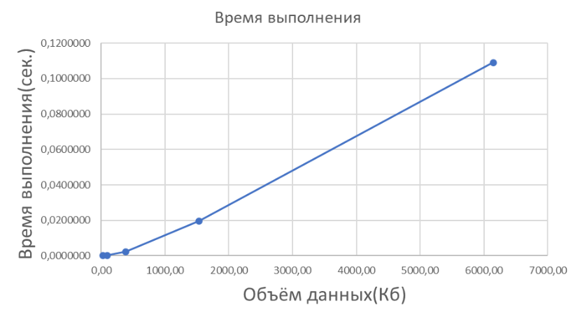

# Лабораторная работа №1 – Умножение квадратных матриц

## Цель работы
Разработать программу на C++ для умножения двух квадратных матриц с последующей верификацией через NumPy.

## Состав проекта
| Файл | Назначение |
|------|------------|
| `matmul.cpp` | Основной код на C++ |
| `check_result.py` | Верификация через NumPy |
| `build.bat` | Компиляция |
| `benchmark.bat` | Запуск тестов |
| `stats.csv` | Результаты замеров |

# Запуск программы

## Требования
- MinGW (g++) с поддержкой C++11
- Python 3.x с установленным пакетом `numpy`

## Зависимости
- Проверка g++  
  `g++ --version`
- Проверка Python  
  `python --version`
- Установка NumPy  
  `pip install numpy`

## Компиляция
- `build.bat`

## Запуск тестов
- `benchmark.bat`

# Процесс проверки
1. C++ программа умножает матрицы и сохраняет результат в `result_matrix.txt`
2. `check_result.py` читает входные матрицы из `matrix_data.txt`
3. NumPy вычисляет эталонное произведение (A × B)
4. Сравнение результата C++ с результатом NumPy
5. Вывод максимальной погрешности и статуса проверки (PASS/FAIL)

# Результаты экспериментальных измерений

## Таблица производительности

В ходе тестирования последовательной версии программы были получены следующие результаты:

| Размер матрицы (N) | Время выполнения (с) | Кол-во арифметических операций | Объём данных (КБ) |
|:------------------:|:--------------------:|:------------------------------:|:-----------------:|
| 32                 | 7.27 × 10⁻⁵          | 64 512                         | 24                |
| 64                 | 2.52 × 10⁻⁴          | 520 192                        | 96                |
| 128                | 2.26 × 10⁻³          | 4 177 920                      | 384               |
| 256                | 1.97 × 10⁻²          | 33 488 896                     | 1 536             |
| 512                | 1.09 × 10⁻¹          | 268 173 312                    | 6 144             |

## Анализ вычислительной сложности

Теоретическая сложность классического алгоритма умножения двух квадратных матриц размером N × N составляет **O(N³)**. Количество операций вычисляется по формуле:
Operations = N³ + N² × (N − 1) = N² × (2N − 1)

## График зависимости времени выполнения от размера матрицы

## График зависимости времени выполнения от размера матрицы

При увеличении размера матрицы с 32 до 512:
- **Рост объёма данных**: в 256 раз (с 24 КБ до 6 144 КБ)
- **Рост количества операций**: в 4 156 раз (с 64 тыс. до 268 млн.)
- **Рост времени выполнения**: в 1 500 раз (с 73 мкс до 109 мс)

## Выводы по лабораторной работе №1

В ходе выполнения работы была разработана и протестирована программа для умножения квадратных матриц на языке C++. Проведённые эксперименты позволили сделать следующие выводы:

1. **Подтверждение теоретической сложности**  
   Экспериментальные данные подтверждают, что классический алгоритм умножения матриц имеет кубическую вычислительную сложность O(N³). При увеличении размера матрицы вдвое время выполнения возрастает примерно в 8 раз.

2. **Практическая неприменимость для больших задач**  
   Уже при размере матрицы 512 × 512 время выполнения составляет около 0.11 секунды. Для матриц размером 2000 × 2000 оценочное время составит ≈ 6–8 секунд, а для 4000 × 4000 — более минуты.

3. **Обоснование необходимости распараллеливания**  
   Полученные результаты демонстрируют, что последовательная реализация не способна эффективно обрабатывать задачи большого объёма. Это является прямым обоснованием для перехода к параллельным технологиям:
   - **OpenMP** — для распараллеливания на многоядерных CPU
   - **MPI** — для распределённых вычислений на кластерах
   - **CUDA** — для использования графических ускорителей

4. **Верификация корректности**  
   Автоматизированная проверка с помощью библиотеки NumPy подтвердила корректность вычислений — максимальное отклонение не превышает 10⁻⁶, что удовлетворяет требованиям лабораторной работы.
