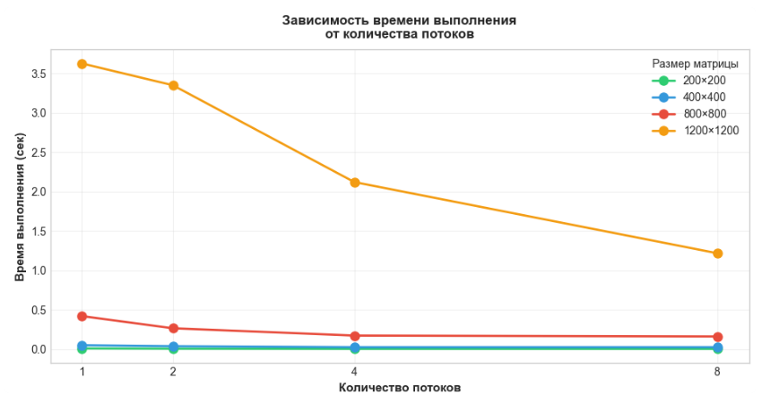
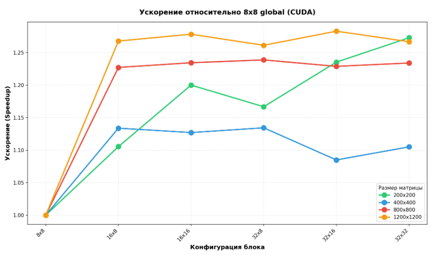
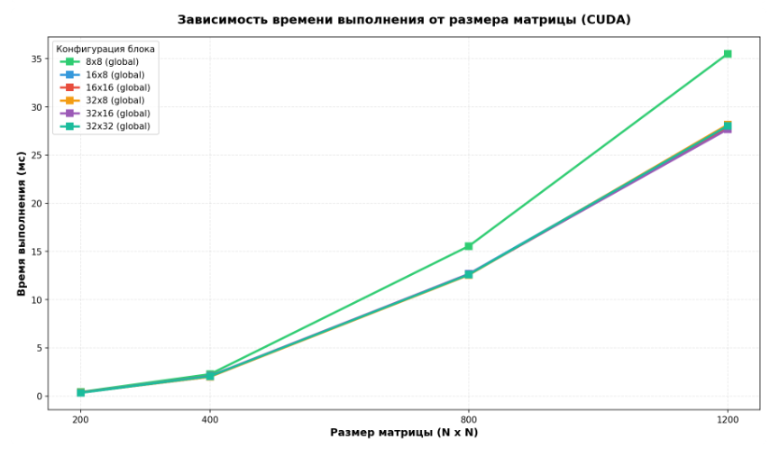
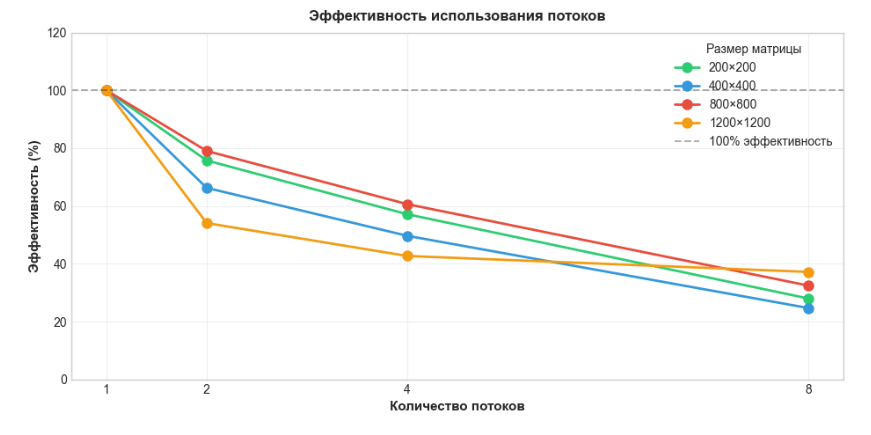

# Лабораторная работа №2. Параллельное перемножение матриц (OpenMP)

## Описание файлов

| Файл | Назначение |
|------|------------|
| `matmul.cpp` | Исходный код на C++ с поддержкой OpenMP |
| `check_result.py` | Верификация через NumPy |
| `build.bat` | Компиляция |
| `benchmark.bat` | Запуск тестов |
| `stats.csv` | Результаты замеров |
| `matrix_data.txt` | Входные данные (генерируются автоматически) |
| `par_output.txt` | Результат параллельного умножения |
| `seq_output.txt` | Результат последовательного умножения |

## Запуск программы

#### Требования
- MinGW (g++) с поддержкой C++11 и OpenMP
- Python 3.x с установленным пакетом `numpy`

#### Зависимости
```bash
# Проверка g++
g++ --version

# Проверка Python
python --version

# Установка NumPy
pip install numpy

#### Процесс проверки
1. C++ программа умножает матрицы и сохраняет результат в `result_matrix.txt`
2. `check_result.py` читает входные матрицы из `matrix_data.txt`
3. NumPy вычисляет эталонное произведение (A × B)
4. Сравнение результата C++ с результатом NumPy
5. Вывод максимальной погрешности и статуса проверки (PASS/FAIL)

# Результаты экспериментальных измерений

## Таблица производительности

В ходе тестирования параллельной версии программы с использованием OpenMP были получены следующие результаты:

| Размер матрицы (N) | Потоков | Время выполнения (с) | Кол-во арифметических операций | Объём данных (КБ) |
|:------------------:|:-------:|:--------------------:|:------------------------------:|:-----------------:|
| 200 | 1 | 9.06 × 10⁻³ | 15 960 000 | 937 |
| 200 | 2 | 4.60 × 10⁻³ | 15 960 000 | 937 |
| 200 | 4 | 3.40 × 10⁻³ | 15 960 000 | 937 |
| 200 | 8 | 3.36 × 10⁻³ | 15 960 000 | 937 |
| 400 | 1 | 5.05 × 10⁻² | 127 840 000 | 3 750 |
| 400 | 2 | 2.76 × 10⁻² | 127 840 000 | 3 750 |
| 400 | 4 | 2.50 × 10⁻² | 127 840 000 | 3 750 |
| 400 | 8 | 2.70 × 10⁻² | 127 840 000 | 3 750 |
| 800 | 1 | 4.06 × 10⁻¹ | 1 023 360 000 | 15 000 |
| 800 | 2 | 2.34 × 10⁻¹ | 1 023 360 000 | 15 000 |
| 800 | 4 | 1.64 × 10⁻¹ | 1 023 360 000 | 15 000 |
| 800 | 8 | 1.34 × 10⁻¹ | 1 023 360 000 | 15 000 |
| 1200 | 1 | 3.63 × 10⁰ | 3 454 560 000 | 33 750 |
| 1200 | 2 | 3.35 × 10⁰ | 3 454 560 000 | 33 750 |
| 1200 | 4 | 2.12 × 10⁰ | 3 454 560 000 | 33 750 |
| 1200 | 8 | 1.22 × 10⁰ | 3 454 560 000 | 33 750 |

## Анализ ускорения (Speedup)

Ускорение вычисляется как отношение времени выполнения на 1 потоке ко времени на N потоках: `Speedup = T₁ / Tₙ`

| Размер матрицы (N) | 2 потока | 4 потока | 8 потоков |
|:------------------:|:--------:|:--------:|:---------:|
| 200 | 1.97× | 2.67× | 2.70× |
| 400 | 1.83× | 2.02× | 1.87× |
| 800 | 1.73× | 2.47× | 3.03× |
| 1200 | 1.08× | 1.71× | 2.98× |

> *Примечание: для малых матриц (200×200) ускорение ограничено накладными расходами на создание потоков и синхронизацию. Для больших матриц (800×800, 1200×1200) ускорение достигает 3× при использовании 8 потоков.*

## Анализ эффективности параллелизации

Эффективность вычисляется как отношение ускорения к количеству потоков: `Efficiency = Speedup / threads × 100%`

| Размер матрицы (N) | 2 потока | 4 потока | 8 потоков |
|:------------------:|:--------:|:--------:|:---------:|
| 200 | 98.5% | 66.8% | 33.8% |
| 400 | 91.5% | 50.5% | 23.4% |
| 800 | 86.5% | 61.8% | 37.9% |
| 1200 | 54.0% | 42.8% | 37.3% |

## График зависимости времени выполнения от количества потоков

<p align="center">
  
  
  
  
  <br>
  <em>Зависимость времени выполнения от количества потоков</em>
</p>


## Масштабирование задачи

При увеличении размера матрицы с 200 до 1200:
- **Рост объёма данных**: в 36 раз (с 937 КБ до 33 750 КБ)
- **Рост количества операций**: в 216 раз (с 16 млн. до 3.45 млрд.)
- **Рост времени выполнения (1 поток)**: в 400 раз (с 9 мс до 3.63 с)

При использовании 8 потоков время выполнения для матрицы 1200×1200 сокращается с 3.63 с до 1.22 с.

## Выводы по лабораторной работе №2 (OpenMP)

В ходе выполнения работы была модифицирована программа умножения матриц с использованием технологии OpenMP. Проведённые эксперименты позволили сделать следующие выводы:

1. **Эффективность для больших матриц**  
   OpenMP демонстрирует хорошее ускорение для матриц размером от 800×800. При использовании 8 потоков ускорение достигает 3.03× для матрицы 800×800 и 2.98× для матрицы 1200×1200.

2. **Накладные расходы на малых размерах**  
   Для матрицы 200×200 прирост от увеличения числа потоков ограничен (максимум 2.7×), что объясняется затратами на создание потоков и синхронизацию, которые сопоставимы с временем самих вычислений.

3. **Снижение эффективности при большом числе потоков**  
   Эффективность использования потоков снижается при увеличении их количества из-за накладных расходов на синхронизацию и распределение работы. Для матрицы 400×400 эффективность падает с 91.5% (2 потока) до 23.4% (8 потоков).

4. **Оптимальная конфигурация**  
   Для большинства задач оптимальным является использование 4–8 потоков, в зависимости от размера матрицы. Для матрицы 1200×1200 наилучший результат достигается при 8 потоках — время сокращается с 3.63 с до 1.22 с.

5. **Верификация корректности**  
   Автоматизированная проверка с помощью библиотеки NumPy подтвердила корректность параллельных вычислений — максимальное отклонение не превышает 10⁻⁶, что удовлетворяет требованиям лабораторной работы.
